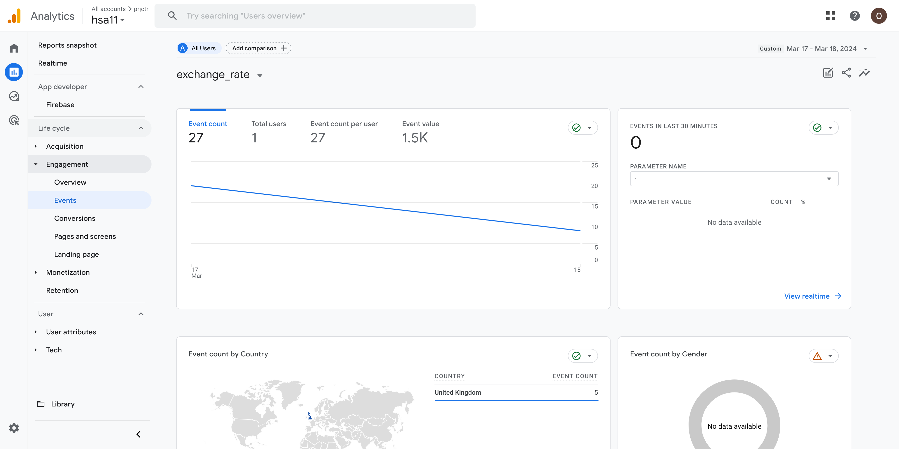

# Monitoring systems for user metrics

## How to init the project

```shell
docker compose up build
docker compose run php composer install
```

## How to start the worker

To check that command works correctly in a single mode:

```shell
docker compose run php bin/console app:exhange-rate-exporter
```

To run it in a loop:

```shell
 while true; do docker compose run php bin/console app:exhange-rate-exporter; sleep 3600; done
```

## How the result looks from the Google Analytics Console




[Credentials to GA Console](https://share.1password.com/s#1MRAkkvnGXtqtmXhhklB7bfNOIkzl4fJgga_gPqr5EI)